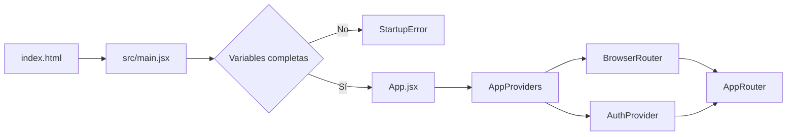
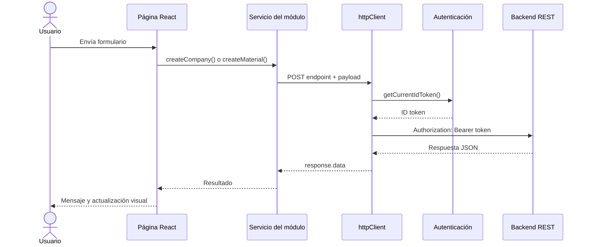
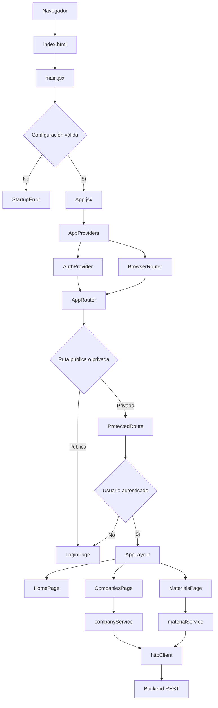

# D. Creación de frontend

[← C. Creación de backend](C-backend.md) | [Volver al README](../README.md) | [Siguiente: E. Despliegue local →](E-despliegue-local.md)

El frontend de **EcoRed Circular** está desarrollado con React y Vite. Implementa autenticación, navegación protegida, registro de empresas, consulta de empresas y publicación de materiales mediante una API REST.

La carpeta `frontend` ya existe dentro del proyecto:

```text
ecored-circular/
├── backend/
├── frontend/
└── docs/
```

No se debe crear otro proyecto con `npm create vite`. El estudiante debe descargar el código suministrado, copiarlo dentro de `ecored-circular/frontend`, configurar sus variables de entorno e instalar las dependencias.

---

## 1. Descargar e instalar el frontend

### 1.1. Descargar el archivo ZIP

Descargar el frontend desde el siguiente enlace:

[**Descargar `frontend.zip`**](https://github.com/adanbeltran/Taller12factors/raw/refs/heads/main/docs/frontend.zip)

El archivo se encuentra en:

```text
Taller12factors/
└── docs/
    └── frontend.zip
```

### 1.2. Crear un respaldo de la carpeta actual

Antes de reemplazar archivos, crear una copia de seguridad de la carpeta `frontend`.

Ejemplo:

```text
ecored-circular/
├── backend/
├── frontend/
├── frontend-respaldo/
└── docs/
```

El respaldo permite recuperar el estado anterior si el archivo ZIP se copia en una ubicación incorrecta.

### 1.3. Descomprimir el archivo

Descomprimir `frontend.zip` en una ubicación temporal, por ejemplo:

```text
Descargas/
└── frontend/
    ├── public/
    ├── src/
    ├── .env.example
    ├── package.json
    ├── package-lock.json
    ├── index.html
    └── vite.config.js
```

No ejecutar el proyecto directamente dentro del archivo comprimido.

### 1.4. Copiar el contenido dentro de `ecored-circular/frontend`

Copiar **el contenido interno** de la carpeta descomprimida dentro de:

```text
ecored-circular/frontend/
```

La estructura correcta debe quedar así:

```text
ecored-circular/
├── backend/
├── docs/
└── frontend/
    ├── public/
    ├── src/
    ├── .env.example
    ├── .gitignore
    ├── eslint.config.js
    ├── index.html
    ├── package.json
    ├── package-lock.json
    └── vite.config.js
```

Evitar esta estructura incorrecta:

```text
ecored-circular/
└── frontend/
    └── frontend/
        └── package.json
```

`package.json` debe quedar directamente dentro de `ecored-circular/frontend`.

### 1.5. Abrir el proyecto en Visual Studio Code

Abrir la carpeta raíz `ecored-circular` en Visual Studio Code.

Abrir una terminal integrada y ejecutar:

```bash
cd frontend
```

Comprobar que la terminal se encuentra en la carpeta correcta.

#### Windows PowerShell

```powershell
Get-Location
Get-ChildItem
```

#### macOS o Linux

```bash
pwd
ls
```

La lista debe mostrar, como mínimo:

```text
package.json
src
public
index.html
vite.config.js
```

### 1.6. Verificar Node.js y npm

```bash
node --version
npm --version
```

Los dos comandos deben devolver una versión instalada.

### 1.7. Instalar las dependencias

```bash
npm install
```

Este comando:

1. Lee las dependencias declaradas en `package.json`.
2. Usa `package-lock.json` para instalar versiones reproducibles.
3. Crea la carpeta local `node_modules`.
4. Instala React, Vite, React Router, Axios, Firebase y Bootstrap.

`node_modules` no debe copiarse manualmente ni subirse al repositorio. Puede reconstruirse ejecutando nuevamente `npm install`.

## Probar la instalación inicial

Ejecutar:

```bash
npm run dev
```

Vite mostrará una URL similar a:

```text
http://localhost:5173
```

Si el puerto está ocupado, puede asignar otro, por ejemplo:

```text
http://localhost:5174
```

En este punto pueden presentarse dos resultados válidos:

- Si `.env` ya contiene todos los valores, debe aparecer la pantalla de inicio de sesión.
- Si faltan variables, debe aparecer una pantalla de **Configuración incompleta** indicando cuáles valores deben definirse.

No debe mostrarse una pantalla completamente blanca.

---

## 2. Crear y configurar `.env`

La configuración local se obtiene a partir de `.env.example`.

Dentro de `ecored-circular/frontend`, crear `.env`.

### Windows PowerShell

```powershell
Copy-Item .env.example .env -Force
```

### Windows CMD

```cmd
copy /Y .env.example .env
```

### macOS o Linux

```bash
cp -f .env.example .env
```

Abrir el archivo:

```text
ecored-circular/frontend/.env
```

Completarlo con la URL local del backend y con los valores suministrados para cada estudiante o equipo:

```env
VITE_API_URL=http://localhost:8000/api

VITE_FIREBASE_API_KEY=VALOR_SUMINISTRADO
VITE_FIREBASE_AUTH_DOMAIN=VALOR_SUMINISTRADO
VITE_FIREBASE_PROJECT_ID=VALOR_SUMINISTRADO
VITE_FIREBASE_APP_ID=VALOR_SUMINISTRADO
```

Reglas de configuración:

1. No modificar los nombres de las variables.
2. No agregar comillas.
3. No dejar espacios antes o después del signo `=`.
4. Copiar exactamente los valores suministrados.
5. Mantener `.env` fuera del repositorio.
6. Conservar `.env.example` como plantilla sin valores particulares.

La variable:

```env
VITE_API_URL=http://localhost:8000/api
```

establece la URL base del backend. Los servicios agregan los endpoints específicos:

```text
VITE_API_URL                    http://localhost:8000/api
Endpoint de empresas            /companies/
URL resultante                  http://localhost:8000/api/companies/

VITE_API_URL                    http://localhost:8000/api
Endpoint de materiales          /materials/
URL resultante                  http://localhost:8000/api/materials/
```

Después de modificar `.env`, detener y reiniciar Vite:

```text
Ctrl + C
```

```bash
npm run dev
```

Vite carga las variables de entorno al iniciar el proceso. Actualizar únicamente el navegador no vuelve a leer `.env`.

---

## 3. Estructura, configuración y arranque del frontend

La organización del proyecto separa la composición global, las funcionalidades de negocio y los elementos reutilizables.

```text
frontend/
├── public/
│   └── favicon.svg
├── src/
│   ├── app/
│   │   ├── App.jsx
│   │   ├── AppProviders.jsx
│   │   └── AppRouter.jsx
│   ├── config/
│   │   ├── env.js
│   │   └── firebase.js
│   ├── features/
│   │   ├── auth/
│   │   ├── companies/
│   │   ├── home/
│   │   └── materials/
│   ├── shared/
│   │   ├── components/
│   │   ├── layouts/
│   │   ├── pages/
│   │   ├── services/
│   │   └── utils/
│   ├── styles/
│   │   └── global.css
│   └── main.jsx
├── .env.example
├── .gitignore
├── eslint.config.js
├── index.html
├── package.json
├── package-lock.json
└── vite.config.js
```

### 3.1. Responsabilidad de las carpetas

| Carpeta | Responsabilidad | Articulación |
|---|---|---|
| `public/` | Archivos estáticos servidos sin transformación. | `index.html` utiliza `/favicon.svg`. |
| `src/app/` | Composición general y definición de rutas. | Recibe el control desde `main.jsx` y monta proveedores, rutas y layouts. |
| `src/config/` | Lectura de variables e inicialización de servicios externos. | `env.js` alimenta `firebase.js` y `httpClient.js`. |
| `src/features/` | Funcionalidades organizadas por dominio. | Cada módulo contiene páginas, componentes y servicios relacionados. |
| `src/shared/` | Elementos reutilizables y transversales. | Es consumido por varios módulos sin pertenecer a uno específico. |
| `src/styles/` | Estilos globales del frontend. | `main.jsx` importa `global.css`. |

### 3.2. Responsabilidad de los archivos de la raíz

| Archivo | Funcionalidad |
|---|---|
| `package.json` | Declara dependencias y scripts de ejecución, validación y construcción. |
| `package-lock.json` | Fija las versiones resueltas por npm. |
| `vite.config.js` | Configura Vite y el plugin de React. |
| `eslint.config.js` | Configura el análisis estático del código. |
| `index.html` | Crea el nodo `#root` y carga `/src/main.jsx`. |
| `.env.example` | Define las variables que debe completar cada estudiante. |
| `.gitignore` | Excluye `.env`, `node_modules`, `dist` y otros archivos locales. |

### 3.3. `index.html`

Fragmento principal:

```html
<body>
  <div id="root"></div>
  <script type="module" src="/src/main.jsx"></script>
</body>
```

Funcionalidad:

- El navegador carga primero `index.html`.
- `<div id="root"></div>` es el contenedor de toda la interfaz.
- El script importa `src/main.jsx`.
- React reemplaza el contenido de `#root` con la aplicación.

### 3.4. `src/main.jsx`

Fragmento de arranque:

```jsx
const rootElement = document.getElementById("root");

if (!rootElement) {
  throw new Error("No se encontró el elemento HTML #root en index.html.");
}

const root = createRoot(rootElement);

if (!isEnvironmentConfigured()) {
  renderStartupError({
    title: "Configuración incompleta",
    missingVariables: getMissingEnvironmentVariables(),
  });
} else {
  import("./app/App.jsx")
    .then(({ default: App }) => {
      root.render(
        <StrictMode>
          <App />
        </StrictMode>,
      );
    });
}
```

Funcionalidad:

1. Busca el nodo `#root`.
2. Crea la raíz de React.
3. Verifica la configuración de `.env`.
4. Presenta un error visible si faltan variables.
5. Importa `App.jsx` solo cuando la configuración es válida.
6. Evita que una excepción de configuración produzca una pantalla blanca.

### 3.5. `src/config/env.js`

Variables obligatorias:

```javascript
export const REQUIRED_ENV_VARIABLES = Object.freeze([
  "VITE_API_URL",
  "VITE_FIREBASE_API_KEY",
  "VITE_FIREBASE_AUTH_DOMAIN",
  "VITE_FIREBASE_PROJECT_ID",
  "VITE_FIREBASE_APP_ID",
]);
```

Configuración centralizada:

```javascript
export const env = Object.freeze({
  apiUrl: normalize(rawEnv.VITE_API_URL).replace(/\/+$/, ""),
  firebase: Object.freeze({
    apiKey: normalize(rawEnv.VITE_FIREBASE_API_KEY),
    authDomain: normalize(rawEnv.VITE_FIREBASE_AUTH_DOMAIN),
    projectId: normalize(rawEnv.VITE_FIREBASE_PROJECT_ID),
    appId: normalize(rawEnv.VITE_FIREBASE_APP_ID),
  }),
});
```

`env.js` evita que cada componente lea directamente `import.meta.env`. La configuración queda concentrada en un único punto.

### 3.6. `src/config/firebase.js`

Fragmento principal:

```javascript
const firebaseApp = getApps().length
  ? getApp()
  : initializeApp({
      apiKey: env.firebase.apiKey,
      authDomain: env.firebase.authDomain,
      projectId: env.firebase.projectId,
      appId: env.firebase.appId,
    });

export const auth = getAuth(firebaseApp);
export const googleProvider = new GoogleAuthProvider();
```

Este archivo:

- Inicializa una única instancia de la aplicación de autenticación.
- Consume la configuración validada por `env.js`.
- Exporta `auth` y `googleProvider`.
- Es utilizado por `authService.js`.

### 3.7. `src/app/App.jsx`

```jsx
export default function App() {
  return (
    <AppProviders>
      <AppRouter />
    </AppProviders>
  );
}
```

`App.jsx` mantiene separadas dos responsabilidades:

- `AppProviders`: infraestructura global.
- `AppRouter`: mapa de navegación.

### 3.8. `src/app/AppProviders.jsx`

```jsx
export default function AppProviders({ children }) {
  return (
    <BrowserRouter>
      <AuthProvider>{children}</AuthProvider>
    </BrowserRouter>
  );
}
```

Articulación:

```text
BrowserRouter
└── AuthProvider
    └── AppRouter
```

Los componentes internos pueden usar navegación y autenticación porque están contenidos dentro de ambos proveedores.

### Gráfica del flujo de arranque



---

## 4. Crear el cliente HTTP y conectar con el backend

Archivo:

```text
frontend/src/shared/services/httpClient.js
```

Fragmento principal:

```javascript
const httpClient = axios.create({
  baseURL: env.apiUrl,
  timeout: 15000,
  headers: {
    Accept: "application/json",
    "Content-Type": "application/json",
  },
});
```

El interceptor agrega el token a las solicitudes:

```javascript
httpClient.interceptors.request.use(async (config) => {
  const token = await getCurrentIdToken();

  if (token) {
    config.headers.Authorization = `Bearer ${token}`;
  }

  return config;
});
```

Responsabilidades:

1. Centralizar `VITE_API_URL`.
2. Establecer el tiempo máximo de espera.
3. Configurar el intercambio de JSON.
4. Obtener el token vigente antes de la petición.
5. Agregar la cabecera `Authorization`.
6. Evitar que cada módulo configure Axios de forma independiente.

### Servicios del módulo de empresas

Archivo:

```text
frontend/src/features/companies/services/companyService.js
```

```javascript
const COMPANIES_ENDPOINT = "/companies/";

export async function listCompanies({ signal } = {}) {
  const response = await httpClient.get(COMPANIES_ENDPOINT, { signal });
  return response.data;
}

export async function createCompany(company) {
  const response = await httpClient.post(COMPANIES_ENDPOINT, company);
  return response.data;
}
```

### Servicios del módulo de materiales

Archivo:

```text
frontend/src/features/materials/services/materialService.js
```

```javascript
const MATERIALS_ENDPOINT = "/materials/";

export async function listMaterials({ signal } = {}) {
  const response = await httpClient.get(MATERIALS_ENDPOINT, { signal });
  return response.data;
}

export async function createMaterial(material) {
  const response = await httpClient.post(MATERIALS_ENDPOINT, material);
  return response.data;
}
```

### Contrato esperado del backend

| Operación | Método | Endpoint |
|---|---:|---|
| Consultar empresas | `GET` | `/companies/` |
| Crear empresa | `POST` | `/companies/` |
| Consultar materiales | `GET` | `/materials/` |
| Crear publicación | `POST` | `/materials/` |

### Gráfica de integración



---

## 5. Crear páginas y módulos funcionales

La carpeta `src/features` organiza la aplicación por funcionalidad.

```text
src/features/
├── auth/
├── companies/
├── home/
└── materials/
```

### 5.1. Módulo `auth`

```text
auth/
├── components/
│   └── LoginForm.jsx
├── context/
│   ├── AuthProvider.jsx
│   └── authContext.js
├── hooks/
│   └── useAuth.js
├── pages/
│   └── LoginPage.jsx
├── routes/
│   └── ProtectedRoute.jsx
└── services/
    └── authService.js
```

| Archivo | Funcionalidad |
|---|---|
| `LoginForm.jsx` | Captura correo y contraseña, y presenta los botones de ingreso. |
| `authContext.js` | Define el contexto compartido de autenticación. |
| `AuthProvider.jsx` | Mantiene `user`, `loading` y las operaciones de sesión. |
| `useAuth.js` | Facilita el consumo seguro del contexto. |
| `LoginPage.jsx` | Coordina el formulario, los errores y la navegación. |
| `ProtectedRoute.jsx` | Impide el acceso a rutas privadas sin sesión. |
| `authService.js` | Encapsula las operaciones de autenticación y obtención del token. |

Fragmento de `AuthProvider.jsx`:

```jsx
useEffect(() => {
  const unsubscribe = observeAuthState((nextUser) => {
    setUser(nextUser);
    setLoading(false);
  });

  return unsubscribe;
}, []);
```

El proveedor espera que el servicio confirme el estado real de la sesión. Mientras ocurre la verificación, `loading` permanece activo.

Fragmento de `ProtectedRoute.jsx`:

```jsx
if (loading) {
  return <LoadingSpinner fullPage label="Verificando sesión" />;
}

if (!user) {
  return <Navigate to="/login" replace state={{ from: location }} />;
}

return <Outlet />;
```

Flujo:

```mermaid
flowchart LR
    A[LoginForm] --> B[LoginPage]
    B --> C[useAuth]
    C --> D[AuthProvider]
    D --> E[authService]
    E --> F[Servicio de autenticación]
    F --> D
    D --> G[ProtectedRoute]
    G -->|Usuario válido| H[Outlet]
    G -->|Sin usuario| I[/login]
```

### 5.2. Módulo `home`

```text
home/
└── pages/
    └── HomePage.jsx
```

`HomePage.jsx`:

- Obtiene el usuario mediante `useAuth`.
- Muestra nombre y correo.
- Presenta tarjetas para Empresas y Materiales.
- Utiliza el componente compartido `ModuleCard`.

### 5.3. Módulo `companies`

```text
companies/
├── components/
│   └── CompanyForm.jsx
├── pages/
│   └── CompaniesPage.jsx
└── services/
    └── companyService.js
```

Articulación:

```text
CompanyForm
  ↓ objeto company
CompaniesPage
  ↓ createCompany(company)
companyService
  ↓ POST /companies/
httpClient
  ↓
Backend
```

Fragmento de `CompaniesPage.jsx`:

```jsx
const handleCreateCompany = async (company) => {
  try {
    await createCompany(company);
    setFeedback({
      type: "success",
      message: "Empresa creada correctamente.",
    });
  } catch (error) {
    setFeedback({
      type: "danger",
      message: getErrorMessage(error),
    });
    throw error;
  }
};
```

La página coordina el caso de uso; el formulario presenta los campos y el servicio realiza la petición HTTP.

### 5.4. Módulo `materials`

```text
materials/
├── components/
│   ├── MaterialForm.jsx
│   └── MaterialList.jsx
├── pages/
│   └── MaterialsPage.jsx
└── services/
    └── materialService.js
```

Carga inicial:

```jsx
const [companyData, materialData] = await Promise.all([
  listCompanies({ signal: controller.signal }),
  listMaterials({ signal: controller.signal }),
]);
```

`Promise.all` inicia ambas consultas sin esperar que una termine antes de comenzar la otra.

Creación de publicación:

```jsx
await createMaterial(material);
const refreshedItems = await listMaterials();
setItems(Array.isArray(refreshedItems) ? refreshedItems : []);
```

Después de crear el material, la página vuelve a consultar la colección para mostrar los datos persistidos por el backend.

### 5.5. Elementos compartidos

```text
src/shared/
├── components/
│   ├── AlertMessage.jsx
│   ├── LoadingSpinner.jsx
│   ├── ModuleCard.jsx
│   ├── PageHeader.jsx
│   └── StartupError.jsx
├── layouts/
│   └── AppLayout.jsx
├── pages/
│   └── NotFoundPage.jsx
├── services/
│   └── httpClient.js
└── utils/
    └── getErrorMessage.js
```

| Archivo | Funcionalidad |
|---|---|
| `AlertMessage.jsx` | Presenta mensajes de éxito, error o información. |
| `LoadingSpinner.jsx` | Informa que una operación está en progreso. |
| `ModuleCard.jsx` | Representa una tarjeta reutilizable de acceso a un módulo. |
| `PageHeader.jsx` | Uniforma títulos y subtítulos. |
| `StartupError.jsx` | Muestra errores previos al montaje de la aplicación. |
| `AppLayout.jsx` | Presenta navegación, correo, cierre de sesión y `<Outlet />`. |
| `NotFoundPage.jsx` | Responde a rutas inexistentes. |
| `getErrorMessage.js` | Normaliza errores del backend, red y validación. |

---

## 6. Configurar rutas y navegación

Archivo:

```text
frontend/src/app/AppRouter.jsx
```

Las páginas se cargan bajo demanda:

```jsx
const LoginPage = lazy(() => import("../features/auth/pages/LoginPage.jsx"));
const HomePage = lazy(() => import("../features/home/pages/HomePage.jsx"));
const CompaniesPage = lazy(() =>
  import("../features/companies/pages/CompaniesPage.jsx"),
);
const MaterialsPage = lazy(() =>
  import("../features/materials/pages/MaterialsPage.jsx"),
);
```

Mapa de rutas:

```jsx
<Routes>
  <Route path="/" element={<RootRedirect />} />
  <Route path="/login" element={<LoginPage />} />

  <Route element={<ProtectedRoute />}>
    <Route element={<AppLayout />}>
      <Route path="/home" element={<HomePage />} />
      <Route path="/companies" element={<CompaniesPage />} />
      <Route path="/company" element={<Navigate to="/companies" replace />} />
      <Route path="/materials" element={<MaterialsPage />} />
    </Route>
  </Route>

  <Route path="*" element={<NotFoundPage />} />
</Routes>
```

| Ruta | Acceso | Componente |
|---|---|---|
| `/` | Automático | Redirige a `/home` o `/login`. |
| `/login` | Público | `LoginPage`. |
| `/home` | Protegido | `HomePage`. |
| `/companies` | Protegido | `CompaniesPage`. |
| `/company` | Protegido | Redirige a `/companies`. |
| `/materials` | Protegido | `MaterialsPage`. |
| Cualquier otra | General | `NotFoundPage`. |

### Flujo general de ejecución



---

## Pruebas

### 1. Verificación estática y compilación

```bash
npm run check
```

Este comando ejecuta:

```text
npm run lint
npm run build
```

Resultado esperado:

- Sin errores de ESLint.
- Construcción satisfactoria en `dist/`.

### 2. Inicio del frontend

```bash
npm run dev
```

Abrir la URL informada por Vite.

Resultado esperado:

- Con `.env` completo: pantalla de inicio de sesión.
- Con `.env` incompleto: diagnóstico visible.
- Nunca una pantalla completamente blanca.

### 3. Autenticación

1. Ingresar con las credenciales suministradas o con la cuenta permitida.
2. Verificar la redirección a `/home`.
3. Actualizar el navegador.
4. Confirmar que la sesión se restaura.
5. Cerrar sesión.
6. Intentar acceder directamente a `/materials`.
7. Confirmar la redirección a `/login`.

### 4. Registro de empresa

1. Ingresar a `/companies`.
2. Completar nombre, NIT, ciudad y sector.
3. Pulsar **Guardar empresa**.
4. Verificar el mensaje de éxito.
5. Revisar en DevTools → Red la solicitud:

```http
POST /api/companies/
```

### 5. Publicación de material

1. Ingresar a `/materials`.
2. Verificar la carga de empresas.
3. Seleccionar una empresa.
4. Completar tipo, cantidad, unidad y ubicación.
5. Pulsar **Crear publicación**.
6. Revisar en DevTools → Red:

```http
GET /api/companies/
GET /api/materials/
POST /api/materials/
GET /api/materials/
```

### 6. Comunicación con el backend

Si aparece `ERR_NETWORK`, verificar:

- Backend en ejecución.
- `VITE_API_URL`.
- Puerto del backend.
- Configuración CORS.
- Protocolo HTTP o HTTPS.

Si aparece `401` o `403`, verificar:

- Cabecera `Authorization`.
- Token vigente.
- Correspondencia entre la configuración del frontend y la validación del backend.

### 7. Variables de entorno

Después de modificar `.env`:

```text
Ctrl + C
npm run dev
```

Confirmar que la aplicación usa los nuevos valores.

---

## Evidencia Twelve-Factor transversal en esta sección

- **Factor I. Codebase**: el frontend forma parte del repositorio versionado de `ecored-circular`.
- **Factor II. Dependencies**: las dependencias están declaradas en `package.json` y fijadas mediante `package-lock.json`.
- **Factor III. Config**: la URL del backend y la configuración del servicio de autenticación se reciben mediante variables `VITE_*`.
- **Factor IV. Backing services**: el frontend trata el backend REST y el servicio de autenticación como recursos externos conectables mediante configuración.
- **Factor V. Build, release, run**: `npm run build` genera el artefacto de construcción y `npm run dev` ejecuta el entorno local.
- **Factor VII. Port binding**: Vite publica la interfaz mediante un puerto local.
- **Factor X. Dev/prod parity**: las mismas variables permiten cambiar de entorno sin modificar los componentes ni los servicios del frontend.
